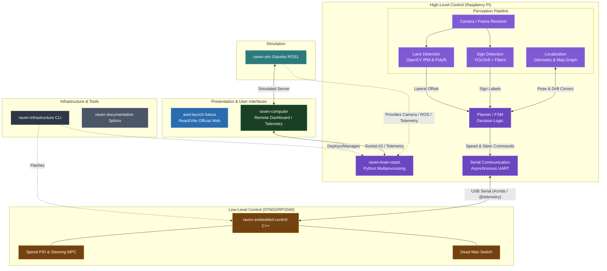

# BFMC Simulator Project

The project contains the entire Gazebo simulator. 
- It can also be used to get a better overview of how the competition is environment looks like
- It can be used in to develop the vehicle state machine
- It can be used to simulate the path planning
- It can be used to set-up a configuration procedure for the real track
- Not suggested for image processing
- Try not to fall in the "continuous simulator developing" trap
- **Manual Control**: The simulator is compatible with the `raven-computer` Dashboard. Run `raven start manual` to drive the simulated car.

## 🌍 Global System Architecture

Tips on how to install and work on it, can be found in the 

## The documentation is available in details here:
[Documentation](https://bosch-future-mobility-challenge-documentation.readthedocs-hosted.com/data/useful/simulator.html)
